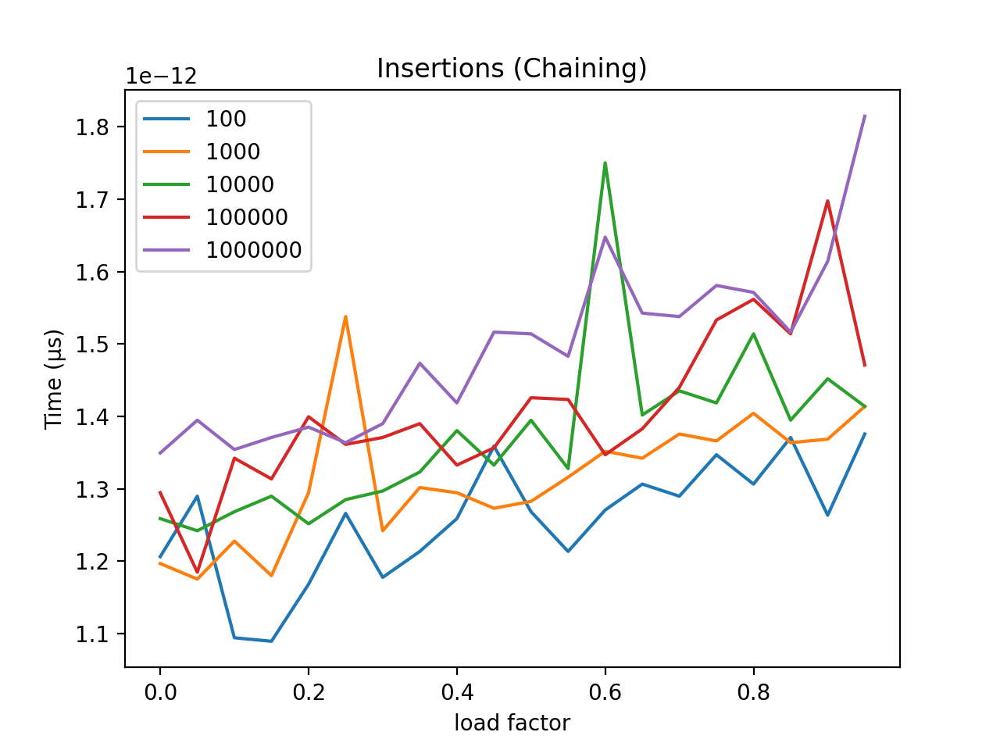
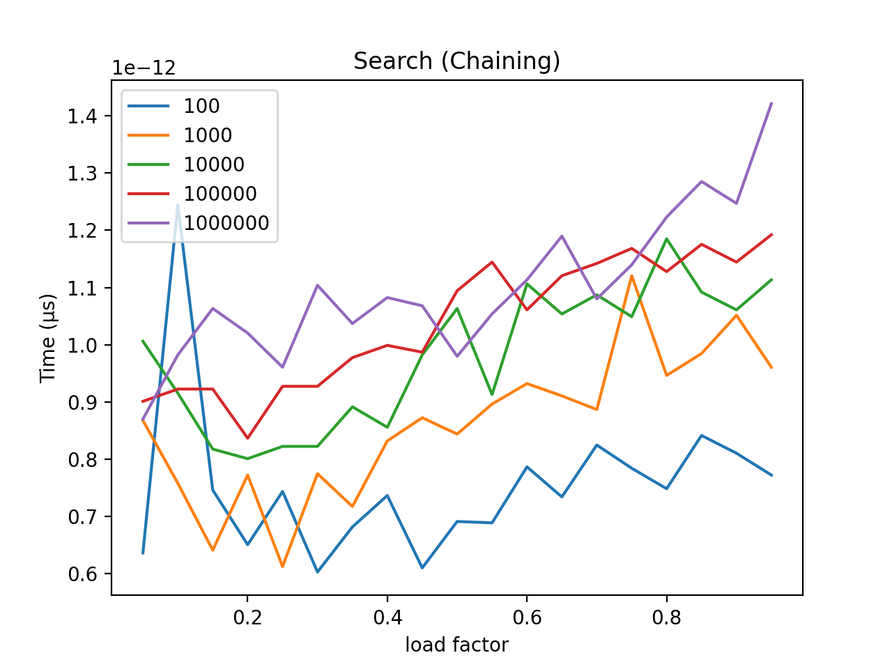

# Hash Tables Benchmarks

The goal of this project was to study the performance of the hash table data structure in terms of time and space efficiency based on the chaining and open addressing algorithms of collision resolution.

<!-- TOC -->

- [Hash Tables Benchmarks](#hash-tables-benchmarks)
    - [Method](#method)
        - [Chaining versus Addressing](#chaining-versus-addressing)
            - [Open Addressing](#open-addressing)
            - [Chaining](#chaining)
            - [Operation Comparison Summary](#operation-comparison-summary)
        - [Calculating Size](#calculating-size)
    - [Configuration](#configuration)
    - [Results](#results)
        - [Insertion](#insertion)
        - [Deletion](#deletion)
        - [Search](#search)
        - [Space](#space)
    - [Interpretations](#interpretations)
    - [Licensing & thanks](#licensing--thanks)
    - [Changelog](#changelog)
    - [Appendix (Tables)](#appendix-tables)

<!-- /TOC -->

## Method

The project itself was executed in Python, and to perform the tests, two classes of hash tables were created, labeled `HashTableChaining` and `HashTableAddressing`. Both classes have similar methods in concept but the fundamental differences between them become more prominent upon closer inspection.

Each hash table class contains the following methods:

```python
def set_table_with_load_factor(self, lf):
def get_index(self, key: str):
def insert(self, key: str):
def lookup(self, key: str):
def remove(self, key: str):
def get_random_val(self):
def print_table(self):
def get_mem_size(self):
def is_empty(self):
```

The testing process consists of creating an array of hash tables with load factors ranging from 0 to 1 in 0.05 increments and hash table sizes ranging from 100 to 1000000. After creation of all the hash tables, each table was tested for:
- Average time to insert one key
- Average time to search for one key
- Average time to delete one key
- Overall memory size.

### Chaining versus Addressing

#### Open Addressing

Collision resolution via open-addressing is implemented using the quadratic probing method to obtain the index of a key in this project.

Quadratic-probing function used:

```python
def quadratic_probe(self, key, collisions):
    return (hash(key) + collisions + 3*(collisions**2)) % self.ARR_LENGTH
```

- `hash(key)` is a python function to return a integer for a given key
- `collisions` is the number of times an index was full but did not contain the key
- `ARR_LENGTH` is the size of the hash table

#### Chaining

The chaining method of collision resolution inserts creates a linked list at each index of the table. The index is retrieved using the python `hash(key)` function and, in this project, a new linked list node is inserted at the head of the list to ensure a constant insertion time.

#### Operation Comparison Summary

Operation |   Chaining  | Open-Addressing
--|---|--
**Insertion**  | Hashes the key to obtain the index and inserts a new node at the beginning of the list to ensure constant insertion time.<p><p>_O(1)_ |  Probes quadratically until an empty index is found or the whole table has been traversed.<p><p>_O(n)_
**Deletion**  | Hashes the key to obtain the index then travels the linked list at the found index until it has found the key or the end of the list.<p><p>_O(n)_  |  Probes quadratically until the key is found or the whole table has been traversed.<p><p>_O(n)_  |
**Search**  | Search operates identically to deletion except returns whether the key is found or not.<p><p>_O(n)_  |  Identical to deletion except returns whether the key is found or not.<p><p>_O(n)_


### Calculating Size

One challenge faced, due to the nature of Python, was the ability to calculate the size of the hash table upon completion.

Per python documentation regarding the `sys.getsizeof(object)` call:

    Return the size of an object in bytes.
    The object can be any type of object.

The documentation goes on to say:

    Only the memory consumption directly attributed to the object is
    accounted for, not the memory consumption of objects it refers to.

This behavior led to hash tables of size 100 and 1000000 with all indices filled having the same size in memory (48 bytes). So in order to find the actual size of these data structures, I used the `sys.getsizeof(object)` call to define the following constants:

```python
SIZE_LIST_NODE = 1064       # size of ListNode class
SIZE_EMPTY_HASH_TABLE = 48  # size of hash table with no insertions
SIZE_ARR_NONE = 8           # size of an array index with a None value
SIZE_ARR_STR = 8            # size of an array index with a 8 character string
```

Once these constants were defined, I used a simple loop to traverse the entire data structure and calculate the actual size in memory.


## Configuration

Execution of the program is performed in one of three ways:

```shell
python3 hash_benchmark.py -o    # open addressing
python3 hash_benchmark.py -c    # chaining
python3 hash_benchmark.py -b    # both open-addressing and chaining
```

> **Note:** This project uses the `matplotlib` Python library to create the graphs, I had some issues getting this to execute on the zeus server.

## Results

### Insertion




> - Open-addressing is faster when the load factor is low, but far slower when the load factor is high.
> - Another note of interest was how erratic the chaining method's graph is compared to the smooth and consistent graph of open-addressing.

### Deletion


> Open-addressing is faster when the load factor is low, but far slower when the load factor is high.

### Search




> Open-addressing is faster when the load factor is low, but far slower when the load factor is high.

### Space


> - Chaining uses far more memory than open-addressing, particularly as the size of the table increases and the load factor increases (more insertions).
> - Open addressing has a static memory size based on the size the table itself.

The tables containing the results for these tests are in [Appendix (Tables)](#appendix-tables).

## Interpretations

After comparison of all of the tests, the data proves shows a common pattern, open-addressing is a faster algorithm for insertion, searching and deletion when the tables are small; but as the table sizes and load factors increase, the chaining algorithm becomes much faster. However, the size overhead accumulated from continuous insertions of a linked list node proves to create a dramatically larger data structure as opposed to the open-addressing method.

The data gathered proves neither algorithm is explicitly better than the other, and what defines the usefulness of an algorithm (or data-structure) is the situation in which the said algorithm is utilized. When considering chaining and open-addressing, if an application only requires a small table, then the open-addressing method is a better choice, but if the table is large, speed is desired and space is not a factor, then chaining is the preferred method.

## Licensing & thanks

This project is released under the [MIT License](./LICENSE.txt).

## Changelog

- v1.0.0

## Appendix (Tables)
```
                INSERTION (Chaining)
------------------------------------------------------------
LENGTH    LF      START_INSERTIONS    TIME
------------------------------------------------------------
100       0.0     0                   1.2803077697753907e-06
100       0.05    5                   1.1658668518066405e-06
100       0.1     10                  1.2302398681640625e-06
100       0.15    15                  1.1467933654785155e-06
100       0.2     20                  1.3589859008789063e-06
100       0.25    25                  1.3041496276855468e-06
100       0.3     30                  1.2803077697753907e-06
100       0.35    35                  1.2660026550292968e-06
100       0.4     40                  1.2516975402832031e-06
100       0.45    45                  1.25885009765625e-06
100       0.5     50                  1.2612342834472656e-06
100       0.55    55                  1.2755393981933593e-06
100       0.6     60                  1.2874603271484376e-06
100       0.65    65                  1.2111663818359375e-06
100       0.7     70                  1.2946128845214843e-06
100       0.75    75                  1.208782196044922e-06
100       0.8     80                  1.3232231140136718e-06
100       0.85    85                  1.3184547424316407e-06
100       0.9     90                  1.3208389282226563e-06
100       0.95    95                  1.3136863708496093e-06
1000      0.0     0                   1.175403594970703e-06
1000      0.05    50                  1.194477081298828e-06
1000      0.1     100                 1.163482666015625e-06
1000      0.15    150                 1.1730194091796875e-06
1000      0.2     200                 1.2183189392089845e-06
1000      0.25    250                 1.2516975402832031e-06
1000      0.3     300                 1.25885009765625e-06
1000      0.35    350                 1.354217529296875e-06
1000      0.4     400                 1.316070556640625e-06
1000      0.45    450                 1.354217529296875e-06
1000      0.5     500                 1.3518333435058594e-06
1000      0.55    550                 1.33514404296875e-06
1000      0.6     600                 1.3399124145507813e-06
1000      0.65    650                 1.3804435729980469e-06
1000      0.7     700                 1.3661384582519532e-06
1000      0.75    750                 1.3136863708496093e-06
1000      0.8     800                 1.3065338134765626e-06
1000      0.85    850                 1.3780593872070313e-06
1000      0.9     900                 1.3327598571777343e-06
1000      0.95    950                 1.3589859008789063e-06
10000     0.0     0                   1.2183189392089845e-06
10000     0.05    500                 1.208782196044922e-06
10000     0.1     1000                1.3589859008789063e-06
10000     0.15    1500                1.2564659118652343e-06
10000     0.2     2000                1.3589859008789063e-06
10000     0.25    2500                1.316070556640625e-06
10000     0.3     3000                1.3470649719238282e-06
10000     0.35    3500                1.2826919555664062e-06
10000     0.4     4000                1.3041496276855468e-06
10000     0.45    4500                1.3613700866699219e-06
10000     0.5     5000                1.461505889892578e-06
10000     0.55    5500                1.3685226440429688e-06
10000     0.6     6000                1.4448165893554687e-06
10000     0.65    6500                1.2493133544921876e-06
10000     0.7     7000                1.418590545654297e-06
10000     0.75    7500                1.373291015625e-06
10000     0.8     8000                1.4066696166992188e-06
10000     0.85    8500                1.3232231140136718e-06
10000     0.9     9000                1.41143798828125e-06
10000     0.95    9500                1.3589859008789063e-06
100000    0.0     0                   1.25885009765625e-06
100000    0.05    5000                1.2159347534179687e-06
100000    0.1     10000               1.3399124145507813e-06
100000    0.15    15000               1.4829635620117187e-06
100000    0.2     20000               1.4090538024902344e-06
100000    0.25    25000               1.3637542724609374e-06
100000    0.3     30000               1.2660026550292968e-06
100000    0.35    35000               1.3613700866699219e-06
100000    0.4     40000               1.373291015625e-06
100000    0.45    45000               1.3971328735351563e-06
100000    0.5     50000               1.4281272888183594e-06
100000    0.55    55000               1.4162063598632813e-06
100000    0.6     60000               1.4209747314453125e-06
100000    0.65    65000               1.4829635620117187e-06
100000    0.7     70000               1.4781951904296875e-06
100000    0.75    75000               1.4519691467285156e-06
100000    0.8     80000               1.5115737915039062e-06
100000    0.85    85000               1.5568733215332032e-06
100000    0.9     90000               1.5354156494140626e-06
100000    0.95    95000               1.6069412231445313e-06
1000000   0.0     0                   1.2660026550292968e-06
1000000   0.05    50000               1.3947486877441405e-06
1000000   0.1     100000              1.3065338134765626e-06
1000000   0.15    150000              1.2874603271484376e-06
1000000   0.2     200000              1.385211944580078e-06
1000000   0.25    250000              1.4066696166992188e-06
1000000   0.3     300000              1.4257431030273439e-06
1000000   0.35    350000              1.3709068298339844e-06
1000000   0.4     400000              1.4138221740722656e-06
1000000   0.45    450000              1.4400482177734375e-06
1000000   0.5     500000              1.423358917236328e-06
1000000   0.55    550000              1.5163421630859376e-06
1000000   0.6     600000              1.4066696166992188e-06
1000000   0.65    650000              1.5354156494140626e-06
1000000   0.7     700000              1.5163421630859376e-06
1000000   0.75    750000              1.5497207641601562e-06
1000000   0.8     800000              1.5568733215332032e-06
1000000   0.85    850000              1.5926361083984374e-06
1000000   0.9     900000              1.506805419921875e-06
1000000   0.95    950000              1.5354156494140626e-06
------------------------------------------------------------

                    SEARCH (Chaining)
------------------------------------------------------------
LENGTH    LF      TIME
------------------------------------------------------------
100       0.05    5.841255187988282e-07
100       0.1     7.343292236328125e-07
100       0.15    6.461143493652344e-07
100       0.2     6.651878356933594e-07
100       0.25    6.842613220214844e-07
100       0.3     6.198883056640625e-07
100       0.35    6.437301635742188e-07
100       0.4     6.628036499023437e-07
100       0.45    6.151199340820313e-07
100       0.5     5.865097045898437e-07
100       0.55    6.604194641113281e-07
100       0.6     7.009506225585937e-07
100       0.65    6.318092346191406e-07
100       0.7     6.055831909179688e-07
100       0.75    7.224082946777343e-07
100       0.8     6.723403930664062e-07
100       0.85    7.462501525878906e-07
100       0.9     7.43865966796875e-07
100       0.95    7.605552673339844e-07
1000      0.05    7.43865966796875e-07
1000      0.1     6.651878356933594e-07
1000      0.15    7.43865966796875e-07
1000      0.2     6.4849853515625e-07
1000      0.25    7.796287536621094e-07
1000      0.3     7.414817810058593e-07
1000      0.35    7.081031799316407e-07
1000      0.4     7.367134094238281e-07
1000      0.45    6.723403930664062e-07
1000      0.5     7.796287536621094e-07
1000      0.55    7.462501525878906e-07
1000      0.6     8.320808410644532e-07
1000      0.65    8.463859558105468e-07
1000      0.7     8.559226989746093e-07
1000      0.75    8.058547973632812e-07
1000      0.8     8.630752563476563e-07
1000      0.85    8.392333984375e-07
1000      0.9     9.250640869140625e-07
1000      0.95    9.298324584960937e-07
10000     0.05    7.128715515136719e-07
10000     0.1     7.200241088867188e-07
10000     0.15    6.985664367675782e-07
10000     0.2     7.081031799316407e-07
10000     0.25    7.295608520507813e-07
10000     0.3     6.794929504394531e-07
10000     0.35    8.20159912109375e-07
10000     0.4     8.988380432128906e-07
10000     0.45    8.96453857421875e-07
10000     0.5     8.392333984375e-07
10000     0.55    8.535385131835938e-07
10000     0.6     8.678436279296875e-07
10000     0.65    9.226799011230469e-07
10000     0.7     8.678436279296875e-07
10000     0.75    9.34600830078125e-07
10000     0.8     9.5367431640625e-07
10000     0.85    9.703636169433594e-07
10000     0.9     1.0395050048828126e-06
10000     0.95    9.870529174804687e-07
100000    0.05    6.628036499023437e-07
100000    0.1     6.723403930664062e-07
100000    0.15    7.700920104980469e-07
100000    0.2     7.82012939453125e-07
100000    0.25    8.821487426757813e-07
100000    0.3     8.678436279296875e-07
100000    0.35    8.96453857421875e-07
100000    0.4     9.775161743164062e-07
100000    0.45    9.5367431640625e-07
100000    0.5     9.703636169433594e-07
100000    0.55    9.894371032714845e-07
100000    0.6     1.2493133544921876e-06
100000    0.65    1.5473365783691407e-06
100000    0.7     1.2159347534179687e-06
100000    0.75    1.0991096496582032e-06
100000    0.8     1.1444091796875e-06
100000    0.85    1.2159347534179687e-06
100000    0.9     1.10626220703125e-06
100000    0.95    1.170635223388672e-06
1000000   0.05    9.1552734375e-07
1000000   0.1     9.417533874511719e-07
1000000   0.15    9.441375732421875e-07
1000000   0.2     1.0061264038085937e-06
1000000   0.25    1.1444091796875e-06
1000000   0.3     1.0251998901367187e-06
1000000   0.35    9.298324584960937e-07
1000000   0.4     9.965896606445312e-07
1000000   0.45    1.1277198791503907e-06
1000000   0.5     1.1301040649414063e-06
1000000   0.55    1.1229515075683594e-06
1000000   0.6     1.2731552124023437e-06
1000000   0.65    1.1539459228515625e-06
1000000   0.7     1.1777877807617188e-06
1000000   0.75    1.2326240539550781e-06
1000000   0.8     1.3113021850585938e-06
1000000   0.85    1.1920928955078125e-06
1000000   0.9     1.5950202941894532e-06
1000000   0.95    1.8453598022460938e-06
------------------------------------------------------------

                DELETE (Chaining)
------------------------------------------------------------
LENGTH    LF      TIME
------------------------------------------------------------
100       0.05    6.628036499023437e-07
100       0.1     7.748603820800781e-07
100       0.15    6.556510925292969e-07
100       0.2     5.984306335449218e-07
100       0.25    7.939338684082031e-07
100       0.3     7.2479248046875e-07
100       0.35    6.4849853515625e-07
100       0.4     7.319450378417968e-07
100       0.45    6.508827209472656e-07
100       0.5     7.724761962890626e-07
100       0.55    8.034706115722657e-07
100       0.6     7.82012939453125e-07
100       0.65    8.177757263183594e-07
100       0.7     8.392333984375e-07
100       0.75    8.177757263183594e-07
100       0.8     7.796287536621094e-07
100       0.85    8.20159912109375e-07
100       0.9     9.131431579589844e-07
100       0.95    8.797645568847656e-07
1000      0.05    7.867813110351562e-07
1000      0.1     6.723403930664062e-07
1000      0.15    7.343292236328125e-07
1000      0.2     7.414817810058593e-07
1000      0.25    8.273124694824219e-07
1000      0.3     8.344650268554688e-07
1000      0.35    9.560585021972656e-07
1000      0.4     8.344650268554688e-07
1000      0.45    8.58306884765625e-07
1000      0.5     8.869171142578125e-07
1000      0.55    9.107589721679687e-07
1000      0.6     9.202957153320312e-07
1000      0.65    8.416175842285156e-07
1000      0.7     8.511543273925781e-07
1000      0.75    9.393692016601562e-07
1000      0.8     9.441375732421875e-07
1000      0.85    9.441375732421875e-07
1000      0.9     1.0037422180175781e-06
1000      0.95    1.02996826171875e-06
10000     0.05    6.771087646484375e-07
10000     0.1     7.43865966796875e-07
10000     0.15    7.200241088867188e-07
10000     0.2     8.249282836914062e-07
10000     0.25    8.726119995117188e-07
10000     0.3     8.106231689453125e-07
10000     0.35    8.654594421386718e-07
10000     0.4     8.916854858398438e-07
10000     0.45    8.96453857421875e-07
10000     0.5     8.797645568847656e-07
10000     0.55    9.79900360107422e-07
10000     0.6     1.0395050048828126e-06
10000     0.65    1.0085105895996095e-06
10000     0.7     1.0132789611816406e-06
10000     0.75    1.1467933654785155e-06
10000     0.8     1.1014938354492188e-06
10000     0.85    1.2540817260742187e-06
10000     0.9     1.3422966003417968e-06
10000     0.95    1.3375282287597657e-06
100000    0.05    8.7738037109375e-07
100000    0.1     8.726119995117188e-07
100000    0.15    8.416175842285156e-07
100000    0.2     9.226799011230469e-07
100000    0.25    8.749961853027344e-07
100000    0.3     9.179115295410156e-07
100000    0.35    9.84668731689453e-07
100000    0.4     1.0466575622558593e-06
100000    0.45    1.0800361633300782e-06
100000    0.5     1.3399124145507813e-06
100000    0.55    1.156330108642578e-06
100000    0.6     1.1324882507324219e-06
100000    0.65    1.2564659118652343e-06
100000    0.7     1.2111663818359375e-06
100000    0.75    1.2922286987304687e-06
100000    0.8     1.6880035400390625e-06
100000    0.85    1.9550323486328123e-06
100000    0.9     1.9550323486328123e-06
100000    0.95    2.0003318786621095e-06
1000000   0.05    8.96453857421875e-07
1000000   0.1     7.62939453125e-07
1000000   0.15    9.1552734375e-07
1000000   0.2     1.0323524475097656e-06
1000000   0.25    8.797645568847656e-07
1000000   0.3     8.893013000488281e-07
1000000   0.35    1.02996826171875e-06
1000000   0.4     1.0514259338378907e-06
1000000   0.45    1.0013580322265625e-06
1000000   0.5     1.0943412780761718e-06
1000000   0.55    1.0609626770019532e-06
1000000   0.6     1.175403594970703e-06
1000000   0.65    1.227855682373047e-06
1000000   0.7     1.0561943054199218e-06
1000000   0.75    1.2254714965820312e-06
1000000   0.8     1.2660026550292968e-06
1000000   0.85    1.2612342834472656e-06
1000000   0.9     1.3375282287597657e-06
1000000   0.95    1.5091896057128906e-06
------------------------------------------------------------

                MEMORY (Chaining)
------------------------------------------------------------
LENGTH    LF      MEMORY
------------------------------------------------------------
100       0.0     848
100       0.05    6128
100       0.1     11408
100       0.15    16688
100       0.2     21968
100       0.25    27248
100       0.3     32528
100       0.35    37808
100       0.4     42032
100       0.45    48368
100       0.5     53648
100       0.55    58928
100       0.6     64208
100       0.65    67376
100       0.7     74768
100       0.75    78992
100       0.8     83216
100       0.85    90608
100       0.9     93776
100       0.95    101168
1000      0.0     8048
1000      0.05    60848
1000      0.1     113648
1000      0.15    166448
1000      0.2     219248
1000      0.25    272048
1000      0.3     323792
1000      0.35    377648
1000      0.4     430448
1000      0.45    483248
1000      0.5     536048
1000      0.55    588848
1000      0.6     640592
1000      0.65    694448
1000      0.7     747248
1000      0.75    800048
1000      0.8     852848
1000      0.85    905648
1000      0.9     958448
1000      0.95    1011248
10000     0.0     80048
10000     0.05    608048
10000     0.1     1136048
10000     0.15    1664048
10000     0.2     2192048
10000     0.25    2720048
10000     0.3     3248048
10000     0.35    3776048
10000     0.4     4304048
10000     0.45    4832048
10000     0.5     5360048
10000     0.55    5888048
10000     0.6     6416048
10000     0.65    6944048
10000     0.7     7472048
10000     0.75    8000048
10000     0.8     8528048
10000     0.85    9056048
10000     0.9     9584048
10000     0.95    10112048
100000    0.0     800048
100000    0.05    6080048
100000    0.1     11360048
100000    0.15    16640048
100000    0.2     21920048
100000    0.25    27200048
100000    0.3     32480048
100000    0.35    37760048
100000    0.4     43040048
100000    0.45    48320048
100000    0.5     53600048
100000    0.55    58880048
100000    0.6     64160048
100000    0.65    69440048
100000    0.7     74720048
100000    0.75    80000048
100000    0.8     85280048
100000    0.85    90560048
100000    0.9     95840048
100000    0.95    101120048
1000000   0.0     8000048
1000000   0.05    60800048
1000000   0.1     113600048
1000000   0.15    166400048
1000000   0.2     219200048
1000000   0.25    272000048
1000000   0.3     324800048
1000000   0.35    377600048
1000000   0.4     430400048
1000000   0.45    483200048
1000000   0.5     536000048
1000000   0.55    588800048
1000000   0.6     641600048
1000000   0.65    694400048
1000000   0.7     747200048
1000000   0.75    800000048
1000000   0.8     852800048
1000000   0.85    905600048
1000000   0.9     958400048
1000000   0.95    1011200048
------------------------------------------------------------

            INSERTION (Open-Addressing)
------------------------------------------------------------
LENGTH    LF      START_INSERTIONS    TIME
------------------------------------------------------------
100       0.0     0                   2.167224884033203e-06
100       0.05    5                   2.491474151611328e-06
100       0.1     10                  2.651214599609375e-06
100       0.15    15                  2.610683441162109e-06
100       0.2     20                  2.510547637939453e-06
100       0.25    25                  3.3259391784667967e-06
100       0.3     30                  3.5238265991210936e-06
100       0.35    35                  3.371238708496094e-06
100       0.4     40                  4.072189331054687e-06
100       0.45    45                  4.727840423583984e-06
100       0.5     50                  4.999637603759765e-06
100       0.55    55                  5.457401275634766e-06
100       0.6     60                  5.364418029785156e-06
100       0.65    65                  6.625652313232422e-06
100       0.7     70                  6.08205795288086e-06
100       0.75    75                  6.2537193298339845e-06
100       0.8     80                  6.825923919677734e-06
100       0.85    85                  6.740093231201172e-06
100       0.9     90                  6.999969482421875e-06
100       0.95    95                  7.998943328857421e-06
1000      0.0     0                   2.25067138671875e-06
1000      0.05    50                  2.331733703613281e-06
1000      0.1     100                 2.6297569274902342e-06
1000      0.15    150                 3.528594970703125e-06
1000      0.2     200                 3.7598609924316405e-06
1000      0.25    250                 5.09023666381836e-06
1000      0.3     300                 5.543231964111328e-06
1000      0.35    350                 6.945133209228515e-06
1000      0.4     400                 8.683204650878907e-06
1000      0.45    450                 9.78708267211914e-06
1000      0.5     500                 1.1146068572998047e-05
1000      0.55    550                 1.21307373046875e-05
1000      0.6     600                 1.446247100830078e-05
1000      0.65    650                 2.167940139770508e-05
1000      0.7     700                 1.6498565673828126e-05
1000      0.75    750                 1.7125606536865234e-05
1000      0.8     800                 1.8351078033447265e-05
1000      0.85    850                 1.9001960754394532e-05
1000      0.9     900                 2.2194385528564454e-05
1000      0.95    950                 3.244638442993164e-05
10000     0.0     0                   2.379417419433594e-06
10000     0.05    500                 3.7980079650878906e-06
10000     0.1     1000                3.972053527832031e-06
10000     0.15    1500                4.4894218444824215e-06
10000     0.2     2000                6.268024444580078e-06
10000     0.25    2500                1.024007797241211e-05
10000     0.3     3000                1.3763904571533202e-05
10000     0.35    3500                1.3685226440429687e-05
10000     0.4     4000                1.8775463104248047e-05
10000     0.45    4500                2.012491226196289e-05
10000     0.5     5000                2.42161750793457e-05
10000     0.55    5500                2.8524398803710938e-05
10000     0.6     6000                3.443241119384765e-05
10000     0.65    6500                3.187417984008789e-05
10000     0.7     7000                4.624605178833008e-05
10000     0.75    7500                4.178285598754883e-05
10000     0.8     8000                4.6143531799316404e-05
10000     0.85    8500                5.0647258758544924e-05
10000     0.9     9000                5.7315826416015626e-05
10000     0.95    9500                5.970478057861328e-05
100000    0.0     0                   2.2530555725097655e-06
100000    0.05    5000                5.567073822021485e-06
100000    0.1     10000               1.1701583862304687e-05
100000    0.15    15000               1.1816024780273438e-05
100000    0.2     20000               2.1119117736816406e-05
100000    0.25    25000               3.0739307403564455e-05
100000    0.3     30000               3.188610076904297e-05
100000    0.35    35000               3.521442413330078e-05
100000    0.4     40000               6.224870681762695e-05
100000    0.45    45000               5.7697296142578125e-05
100000    0.5     50000               6.572961807250977e-05
100000    0.55    55000               7.150888442993164e-05
100000    0.6     60000               0.00010644435882568359
100000    0.65    65000               0.00011627674102783203
100000    0.7     70000               0.00011710643768310547
100000    0.75    75000               0.0001436758041381836
100000    0.8     80000               0.0001497483253479004
100000    0.85    85000               0.00017334938049316407
100000    0.9     90000               0.0002018594741821289
100000    0.95    95000               0.00020658254623413087
1000000   0.0     0                   2.262592315673828e-06
1000000   0.05    50000               8.707046508789063e-06
1000000   0.1     100000              3.541469573974609e-05
1000000   0.15    150000              2.4330615997314452e-05
1000000   0.2     200000              3.537416458129883e-05
1000000   0.25    250000              7.76839256286621e-05
1000000   0.3     300000              0.00013521909713745117
1000000   0.35    350000              9.412527084350586e-05
1000000   0.4     400000              0.0001767873764038086
1000000   0.45    450000              0.00017335891723632813
1000000   0.5     500000              0.00024774789810180667
1000000   0.55    550000              0.00029632568359375
1000000   0.6     600000              0.00031252145767211913
1000000   0.65    650000              0.0003596949577331543
1000000   0.7     700000              0.00033381223678588865
1000000   0.75    750000              0.0004416179656982422
1000000   0.8     800000              0.0004789495468139648
1000000   0.85    850000              0.000578005313873291
1000000   0.9     900000              0.0005841326713562012
1000000   0.95    950000              0.0006232786178588867
------------------------------------------------------------

            SEARCH (Open-Addressing)
------------------------------------------------------------
LENGTH    LF      TIME
------------------------------------------------------------
100       0.05    1.10626220703125e-06
100       0.1     1.3756752014160155e-06
100       0.15    1.0061264038085937e-06
100       0.2     1.4138221740722656e-06
100       0.25    1.4901161193847656e-06
100       0.3     1.5902519226074219e-06
100       0.35    1.7714500427246093e-06
100       0.4     1.7547607421875e-06
100       0.45    2.224445343017578e-06
100       0.5     2.2554397583007815e-06
100       0.55    2.4437904357910156e-06
100       0.6     2.875328063964844e-06
100       0.65    3.1900405883789064e-06
100       0.7     4.265308380126953e-06
100       0.75    2.951622009277344e-06
100       0.8     3.173351287841797e-06
100       0.85    3.087520599365234e-06
100       0.9     2.55584716796875e-06
100       0.95    3.24249267578125e-06
1000      0.05    1.2636184692382812e-06
1000      0.1     1.4925003051757812e-06
1000      0.15    1.3875961303710938e-06
1000      0.2     2.17437744140625e-06
1000      0.25    2.593994140625e-06
1000      0.3     2.8443336486816406e-06
1000      0.35    3.0660629272460936e-06
1000      0.4     4.270076751708984e-06
1000      0.45    4.4941902160644535e-06
1000      0.5     5.173683166503906e-06
1000      0.55    6.072521209716797e-06
1000      0.6     6.239414215087891e-06
1000      0.65    5.640983581542969e-06
1000      0.7     6.814002990722656e-06
1000      0.75    8.542537689208984e-06
1000      0.8     8.540153503417969e-06
1000      0.85    8.695125579833984e-06
1000      0.9     1.0442733764648437e-05
1000      0.95    1.678943634033203e-05
10000     0.05    1.5401840209960937e-06
10000     0.1     2.1266937255859375e-06
10000     0.15    2.8347969055175783e-06
10000     0.2     3.087520599365234e-06
10000     0.25    6.4730644226074215e-06
10000     0.3     7.698535919189453e-06
10000     0.35    8.852481842041016e-06
10000     0.4     1.039743423461914e-05
10000     0.45    1.039266586303711e-05
10000     0.5     1.1687278747558594e-05
10000     0.55    1.648902893066406e-05
10000     0.6     2.073049545288086e-05
10000     0.65    2.3543834686279297e-05
10000     0.7     2.552032470703125e-05
10000     0.75    2.8443336486816406e-05
10000     0.8     3.6292076110839843e-05
10000     0.85    3.4880638122558596e-05
10000     0.9     3.3314228057861326e-05
10000     0.95    3.470659255981445e-05
100000    0.05    2.467632293701172e-06
100000    0.1     5.626678466796875e-06
100000    0.15    1.068115234375e-05
100000    0.2     9.670257568359376e-06
100000    0.25    1.2362003326416016e-05
100000    0.3     2.4650096893310547e-05
100000    0.35    2.5420188903808595e-05
100000    0.4     3.860950469970703e-05
100000    0.45    4.564523696899414e-05
100000    0.5     5.530595779418945e-05
100000    0.55    5.527257919311524e-05
100000    0.6     5.199193954467773e-05
100000    0.65    6.030559539794922e-05
100000    0.7     7.044553756713868e-05
100000    0.75    7.416009902954102e-05
100000    0.8     9.057998657226563e-05
100000    0.85    9.179353713989258e-05
100000    0.9     9.605169296264649e-05
100000    0.95    0.00010422945022583008
1000000   0.05    4.546642303466797e-06
1000000   0.1     2.2006034851074218e-05
1000000   0.15    2.060651779174805e-05
1000000   0.2     2.643108367919922e-05
1000000   0.25    3.7572383880615235e-05
1000000   0.3     5.3260326385498044e-05
1000000   0.35    9.169578552246094e-05
1000000   0.4     9.081602096557618e-05
1000000   0.45    0.0001190638542175293
1000000   0.5     0.00011915445327758789
1000000   0.55    0.00015690088272094727
1000000   0.6     0.00017487287521362305
1000000   0.65    0.00017169952392578124
1000000   0.7     0.00025520801544189455
1000000   0.75    0.00023440122604370117
1000000   0.8     0.0002936840057373047
1000000   0.85    0.0003442215919494629
1000000   0.9     0.0003423380851745605
1000000   0.95    0.0003786802291870117
------------------------------------------------------------

            DELETE (Open-Addressing)
------------------------------------------------------------
LENGTH    LF      TIME
------------------------------------------------------------
100       0.05    1.1920928955078125e-06
100       0.1     1.4638900756835937e-06
100       0.15    1.1539459228515625e-06
100       0.2     1.506805419921875e-06
100       0.25    1.5687942504882813e-06
100       0.3     1.5544891357421874e-06
100       0.35    2.1457672119140625e-06
100       0.4     2.0194053649902345e-06
100       0.45    2.1696090698242187e-06
100       0.5     2.17437744140625e-06
100       0.55    2.446174621582031e-06
100       0.6     3.070831298828125e-06
100       0.65    2.932548522949219e-06
100       0.7     3.3831596374511718e-06
100       0.75    3.2901763916015627e-06
100       0.8     3.2019615173339843e-06
100       0.85    2.7632713317871093e-06
100       0.9     2.720355987548828e-06
100       0.95    3.4570693969726562e-06
1000      0.05    1.3041496276855468e-06
1000      0.1     1.94549560546875e-06
1000      0.15    1.690387725830078e-06
1000      0.2     1.7523765563964843e-06
1000      0.25    2.8252601623535155e-06
1000      0.3     2.875328063964844e-06
1000      0.35    3.464221954345703e-06
1000      0.4     3.6668777465820314e-06
1000      0.45    3.821849822998047e-06
1000      0.5     5.104541778564453e-06
1000      0.55    5.91278076171875e-06
1000      0.6     6.7138671875e-06
1000      0.65    7.083415985107422e-06
1000      0.7     6.971359252929687e-06
1000      0.75    6.52313232421875e-06
1000      0.8     9.87529754638672e-06
1000      0.85    9.65118408203125e-06
1000      0.9     1.1343955993652343e-05
1000      0.95    1.6024112701416014e-05
10000     0.05    1.3828277587890625e-06
10000     0.1     2.9277801513671873e-06
10000     0.15    3.731250762939453e-06
10000     0.2     4.0936470031738285e-06
10000     0.25    7.462501525878906e-06
10000     0.3     8.428096771240235e-06
10000     0.35    9.722709655761719e-06
10000     0.4     1.3551712036132813e-05
10000     0.45    1.1548995971679687e-05
10000     0.5     1.41143798828125e-05
10000     0.55    1.8596649169921875e-05
10000     0.6     2.126932144165039e-05
10000     0.65    2.4938583374023436e-05
10000     0.7     2.557516098022461e-05
10000     0.75    2.6311874389648437e-05
10000     0.8     2.7909278869628907e-05
10000     0.85    3.0448436737060545e-05
10000     0.9     3.111839294433594e-05
10000     0.95    3.542423248291016e-05
100000    0.05    2.903938293457031e-06
100000    0.1     3.950595855712891e-06
100000    0.15    5.772113800048828e-06
100000    0.2     1.4898777008056641e-05
100000    0.25    1.760244369506836e-05
100000    0.3     2.6905536651611327e-05
100000    0.35    2.849578857421875e-05
100000    0.4     3.490924835205078e-05
100000    0.45    3.890037536621094e-05
100000    0.5     5.148649215698242e-05
100000    0.55    6.070852279663086e-05
100000    0.6     6.130218505859375e-05
100000    0.65    6.885528564453125e-05
100000    0.7     7.21287727355957e-05
100000    0.75    0.00010318517684936524
100000    0.8     9.439468383789063e-05
100000    0.85    0.00011126518249511719
100000    0.9     0.0001018977165222168
100000    0.95    0.00011851310729980468
1000000   0.05    5.180835723876953e-06
1000000   0.1     5.104541778564453e-06
1000000   0.15    4.749298095703125e-06
1000000   0.2     3.2923221588134766e-05
1000000   0.25    6.508350372314454e-05
1000000   0.3     7.170677185058594e-05
1000000   0.35    6.974935531616211e-05
1000000   0.4     7.916450500488282e-05
1000000   0.45    0.00013160228729248047
1000000   0.5     0.00016855001449584962
1000000   0.55    0.00018468141555786133
1000000   0.6     0.00017623186111450194
1000000   0.65    0.00018252134323120116
1000000   0.7     0.0002575516700744629
1000000   0.75    0.0002857184410095215
1000000   0.8     0.00028034925460815427
1000000   0.85    0.0003724479675292969
1000000   0.9     0.0003305196762084961
1000000   0.95    0.00038273096084594726
------------------------------------------------------------

        MEMORY (Open-Addressing)
------------------------------------------------------------
LENGTH    LF      MEMORY
------------------------------------------------------------
100       0.0     848
100       0.05    848
100       0.1     848
100       0.15    848
100       0.2     848
100       0.25    848
100       0.3     848
100       0.35    848
100       0.4     848
100       0.45    848
100       0.5     848
100       0.55    848
100       0.6     848
100       0.65    848
100       0.7     848
100       0.75    848
100       0.8     848
100       0.85    848
100       0.9     848
100       0.95    848
1000      0.0     8048
1000      0.05    8048
1000      0.1     8048
1000      0.15    8048
1000      0.2     8048
1000      0.25    8048
1000      0.3     8048
1000      0.35    8048
1000      0.4     8048
1000      0.45    8048
1000      0.5     8048
1000      0.55    8048
1000      0.6     8048
1000      0.65    8048
1000      0.7     8048
1000      0.75    8048
1000      0.8     8048
1000      0.85    8048
1000      0.9     8048
1000      0.95    8048
10000     0.0     80048
10000     0.05    80048
10000     0.1     80048
10000     0.15    80048
10000     0.2     80048
10000     0.25    80048
10000     0.3     80048
10000     0.35    80048
10000     0.4     80048
10000     0.45    80048
10000     0.5     80048
10000     0.55    80048
10000     0.6     80048
10000     0.65    80048
10000     0.7     80048
10000     0.75    80048
10000     0.8     80048
10000     0.85    80048
10000     0.9     80048
10000     0.95    80048
100000    0.0     800048
100000    0.05    800048
100000    0.1     800048
100000    0.15    800048
100000    0.2     800048
100000    0.25    800048
100000    0.3     800048
100000    0.35    800048
100000    0.4     800048
100000    0.45    800048
100000    0.5     800048
100000    0.55    800048
100000    0.6     800048
100000    0.65    800048
100000    0.7     800048
100000    0.75    800048
100000    0.8     800048
100000    0.85    800048
100000    0.9     800048
100000    0.95    800048
1000000   0.0     8000048
1000000   0.05    8000048
1000000   0.1     8000048
1000000   0.15    8000048
1000000   0.2     8000048
1000000   0.25    8000048
1000000   0.3     8000048
1000000   0.35    8000048
1000000   0.4     8000048
1000000   0.45    8000048
1000000   0.5     8000048
1000000   0.55    8000048
1000000   0.6     8000048
1000000   0.65    8000048
1000000   0.7     8000048
1000000   0.75    8000048
1000000   0.8     8000048
1000000   0.85    8000048
1000000   0.9     8000048
1000000   0.95    8000048
------------------------------------------------------------
```
