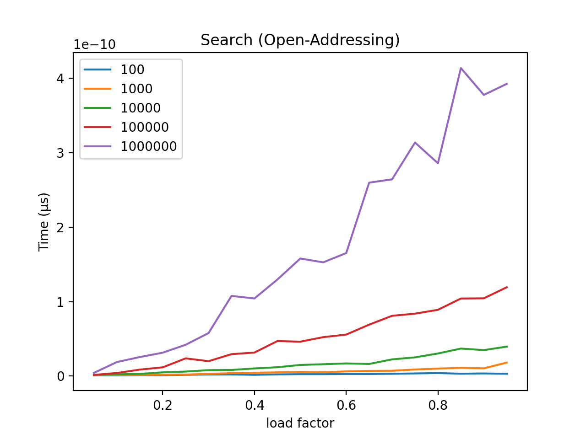
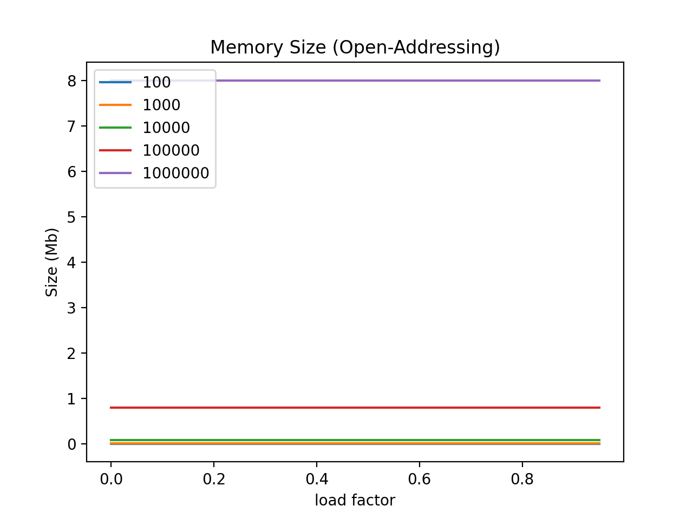

# Hash Tables Benchmarks

The goal of this project was to study the performance of the hash table data structure in terms of time and space efficiency based on the chaining and open addressing algorithms of collision resolution.

<!-- TOC -->

- [Hash Tables Benchmarks](#hash-tables-benchmarks)
    - [About](#about)
        - [Chaining versus Addressing](#chaining-versus-addressing)
        - [Open Addressing](#open-addressing)
        - [Calculating Size](#calculating-size)
    - [Configuration](#configuration)
    - [Results](#results)
        - [Insertion](#insertion)
        - [Deletion](#deletion)
        - [Search](#search)
        - [Space](#space)
    - [Licensing & thanks](#licensing--thanks)
    - [Changelog](#changelog)

<!-- /TOC -->

## Method

The project itself was executed in Python, and to perform the tests, two classes of hash tables were created, labeled `HashTableChaining` and `HashTableAddressing`. Both classes have similar methods in concept but the fundamental differences between them become more prominent upon closer inspection.

Each hash table class contains the following methods:

```python
def set_table_with_load_factor(self, lf):
def get_index(self, key: str):
def insert(self, key: str):
def lookup(self, key: str):
def remove(self, key: str):
def get_random_val(self):
def print_table(self):
def get_mem_size(self):
def is_empty(self):
```

The testing process consists of creating an array of hash tables with load factors ranging from 0 to 1 in 0.05 increments and hash table sizes ranging from 100 to 1000000. After creation of all the hash tables, each table was tested for:
- Time to insert one key
- Time to search for one key
- Time to delete one key
- Overall memory size.

### Chaining versus Addressing

#### Open Addressing

Collision resolution via open-addressing is implemented using the quadratic probing method to obtain the index of a key in this project.

Quadratic-probing function used:

```python
def quadratic_probe(self, key, collisions):
    return (hash(key) + collisions + 3*(collisions**2)) % self.ARR_LENGTH
```

- `hash(key)` is a python function to return a integer for a given key
- `collisions` is the number of times an index was full but did not contain the key
- `ARR_LENGTH` is the size of the hash table

#### Chaining

The chaining method of collision resolution inserts creates a linked list at each index of the table. The index is retrieved using the python `hash(key)` function and, in this project, a new linked list node is inserted at the head of the list to ensure a constant insertion time.

#### Operation Comparison Summary

Operation |   Chaining  | Open-Addressing
--|---|--
**Insertion**  | Hashes the key to obtain the index and inserts a new node at the beginning of the list to ensure constant insertion time.<p><p>_O(1)_ |  Probes quadratically until an empty index is found or the whole table has been traversed.<p><p>_O(n)_
**Deletion**  | Hashes the key to obtain the index then travels the linked list at the found index until it has found the key or the end of the list.<p><p>_O(n)_  |  Probes quadratically until the key is found or the whole table has been traversed.<p><p>_O(n)_  |
**Search**  | Search operates identically to deletion except returns whether the key is found or not.<p><p>_O(n)_  |  Identical to deletion except returns whether the key is found or not.<p><p>_O(n)_


### Calculating Size

One challenge faced, due to the nature of Python, was the ability to calculate the size of the hash table upon completion.

Per python documentation regarding the `sys.getsizeof(object)` call:

    Return the size of an object in bytes.
    The object can be any type of object.

The documentation goes on to say:

    Only the memory consumption directly attributed to the object is
    accounted for, not the memory consumption of objects it refers to.

This behavior led to hash tables of size 100 and 1000000 with all indices filled having the same size in memory (48 bytes). So in order to find the actual size of these data structures, I used the `sys.getsizeof(object)` call to define the following constants:

```python
SIZE_LIST_NODE = 1064       # size of ListNode class
SIZE_EMPTY_HASH_TABLE = 48  # size of hash table with no insertions
SIZE_ARR_NONE = 8           # size of an array index with a None value
SIZE_ARR_STR = 8            # size of an array index with a 8 character string
```

Once these constants were defined, I used a simple loop to traverse the entire data structure and calculate the actual size in memory.


## Configuration

Execution of the program is performed in one of three ways:

```shell
python3 hash_benchmark.py -o    # open addressing
python3 hash_benchmark.py -c    # chaining
python3 hash_benchmark.py -b    # both open-addressing and chaining
```

> **Note:** This project uses the `matplotlib` Python library to create the graphs, I had some issues getting this to execute on the zeus server.

## Results

### Insertion


> - Open-addressing is faster when the load factor is low, but far slower when the load factor is high.
> - Another note of interest was how erratic the chaining method's graph is compared to the smooth and consistent graph of open-addressing.

### Deletion


> Open-addressing is faster when the load factor is low, but far slower when the load factor is high.

### Search




> Open-addressing is faster when the load factor is low, but far slower when the load factor is high.

### Space




> - Chaining uses far more memory than open-addressing, particularly as the size of the table increases and the load factor increases (more insertions).
> - Open addressing has a static memory size based on the size the table itself.

## Interpretations

After comparison of all of the tests, the data proves shows a common pattern, open-addressing is a faster algorithm for insertion, searching and deletion when the tables are small; but as the table sizes and load factors increase, the chaining algorithm becomes much faster. However, the size overhead accumulated from continuous insertions of a linked list node proves to create a dramatically larger data structure as opposed to the open-addressing method.

The data gathered proves neither algorithm is explicitly better than the other, and what defines the usefulness of an algorithm (or data-structure) is the situation in which the said algorithm is utilized. When considering chaining and open-addressing, if an application only requires a small table, then the open-addressing method is a better choice, but if the table is large, speed is desired and space is not a factor, then chaining is the preferred method.

## Licensing & thanks

This project is released under the [MIT License](./LICENSE.txt).

## Changelog

- v1.0.0
