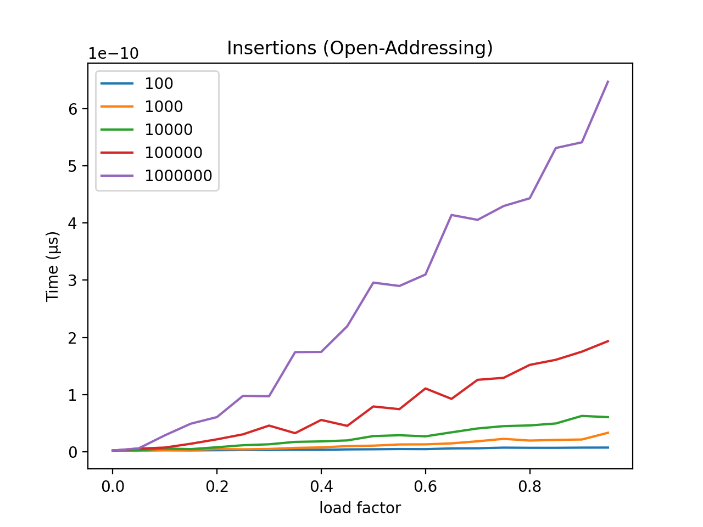
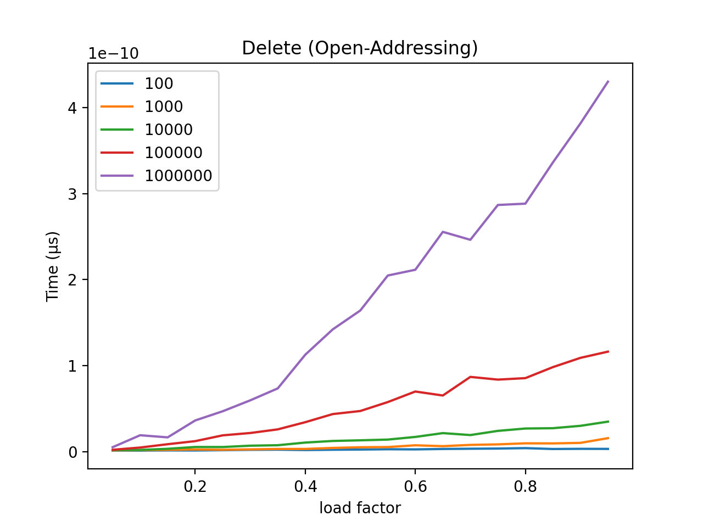

# Hash Tables Benchmarks

The goal of this project was to study the performance of the hash table data structure in terms of time and space efficiency based on the chaining and open addressing algorithms of collision resolution.

## About

The hash table data structure was studied by comparing the effects of collision resolution, namely resolution by chaining and open addressing. In order to accomplish this, I created two classes of hash tables, `HashTableChaining` and `HashTableAddressing`. Each of these classes have similar methods, but vary depending on their method collision resolution; the methods include:

```python
def set_table_with_load_factor(self, lf):
def get_index(self, key: str):
def insert(self, key: str):
def lookup(self, key: str):
def remove(self, key: str):
def get_random_val(self):
def print_table(self):
def get_mem_size(self):
```

### Calculating Size

One challenge faced, due to the nature of Python, was the ability to calculate the size of the hash table upon completion.

Per python documentation regarding the `sys.getsizeof(object)` call:

    Return the size of an object in bytes.
    The object can be any type of object.

The documentation goes on to say:

    Only the memory consumption directly attributed to the object is
    accounted for, not the memory consumption of objects it refers to.

This behavior led to hash tables of size 100 and 1000000 with all indices filled having the same size in memory (48 bytes). So in order to find the actual size of these data structures, I used the `sys.getsizeof(object)` call to define the following constants:

```python
SIZE_LIST_NODE = 1064       # size of ListNode class
SIZE_EMPTY_HASH_TABLE = 48  # size of hash table with no insertions
SIZE_ARR_NONE = 8           # size of an array index with a None value
SIZE_ARR_STR = 8            # size of an array index with a 8 character string
```

Once these constants were defined, I used a simple loop to traverse the entire data structure and calculate the actual size in memory.

### Chaining

Collision resolution via chaining was implemented using a linked list

## Configuration

Program execution:

```shell
python3 hash_benchmark.py -o
python3 hash_benchmark.py -c
```

## Results

### Chaining







## Licensing & thanks

This project is released under the [MIT License](./LICENSE.txt).

## Changelog

- v1.0.0
